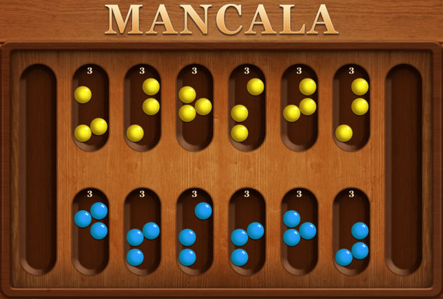
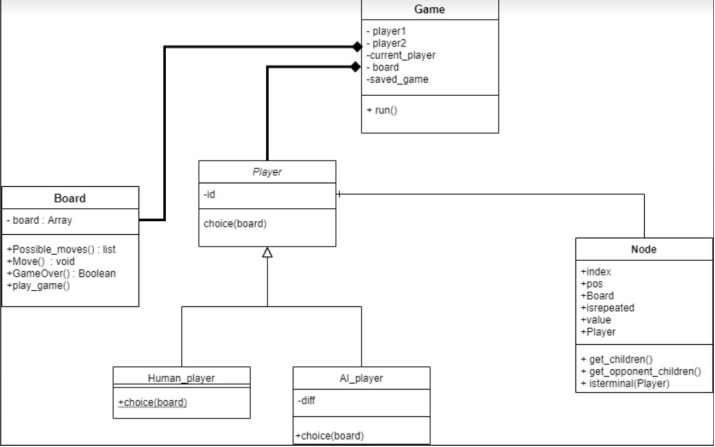

# Mancala Game with AI (human vs Computer)



The project is an implementation of MiniMax algorithm with alpha-beta prunning in Python 3 for creating AI capable of playing a Mancala game. 


**Helper items:**
- Binary executable is inside "dist" Folder.
- [How to use mancala-game youtube video](https://www.youtube.com/watch?v=EU4LVfRKxXY)

# Table of contents
- Project Brief Description
- Class Diagram of the complete design of our game
- Detailed Description of Classes & Functions
- Board Class
- Players Class
- AI_player Class
- Game Class
- Node Class
- User Guide


# Project Brief Description:

Full implementation of the famous Mancala Game from scratch.<br><br>
**Including 4 Modes of the game:**
1. Human player Vs. Human player
2. Human player Vs. Ai player
3. Ai player Vs. Human player
4. Ai player Vs. Ai player


**Project Features:**
1. The Ai player uses MinMax Algorithm With Alpha-beta
Pruning written from scratch.
2. The project supports the “Stealing Mode“ of Mancala
3. Various difficulties of AI player (Easy, Medium, and Hard).
4. Saving and loading the current game in case of any sudden termination during the game.
5. Various checks on users' input before the game or within the game.
6. Alpha beta optimization.
7. Added timer inside the mini-max algorithm.
8. Added iterative deepening variant of minmax algorithm.
9. MinMax optimization using sorting of children.


# Class Diagram of the complete design of our game


# Detailed Description of Classes & Functions
**File Architecture**
```
Mancala Game With Ai Players
|
|── Board.py
|── Players.py
|── Game.py
|── Node.py
|── AI_algorithms.py
|── Ml Algorithms.py
|── Choice_player.py
|── README.md
└── Images
```  


## Board Class:
- The Mancala Board is represented by a list of 14 elements
The first 7 elements are for player 1 (6 holes for stones + 1 for mancala
itself) and the other 7 are for player 2.
- The board is always printed on each play ... starting the game with
value 4 in each hole and zeros for mancalas.
- Possible moves function: returns the possible moves for each player,
as player 1 is allowed to play from his side of board, and also the entered played position mustn’t equal 0.

```Python
from copy import deepcopy
start_board = [4] * 6 + [0] + [4]*6 + [0]

class Board():
    def __init__(self, start_board=start_board):
    def Possible_moves(self, player_turn):
    def Move(self, pos, player_turn, stealing=True):
    def who_win(self):
    def score(self, player):
    def GameOver(self):
    def play_game(self):
    def __str__(self):
```
- **Move function:** is the core of playing the game, the function which is
responsible for the basic movement of mancala. At first, passing the entered position by the user, then checking
If it is a valid input, if so a value of 1 added to each neighbor until the
value of the entered position on the board is 0.
- **Stealing mode:**
If stealing mode is on, and at any time there is a hole on the board
which has a value of 1 and the opposite hole on board is not empty, so
add that 1 + the value of the opposite hole’s value and add the result to
the mancala of the player who has a value 1 in his side of the board
and exactly vice versa for the other player if that case ever happened.

- Who_win: a simple check on which player has a higher score on his
mancala, to be the winner of the game.
- Score function: checks if all holes on any side of the board are empty
(the end of the game) and if so, we will add all the holes’ values of the
other side of the board to this player’s side mancala.
This function returns the difference score between the 2 mancalas to
determine who wins.
- GameOver function: just check on the end of the game condition stated
before and calculating the final score in each mancala.
- Play_game function: just applying the logic explained in all the past
functions, Player move then XORING the player turn as the switch play
(player 0 and 1) Then return the final score.


## Players Class
When instantiating an object of player class, it automatically given an id to mark him.
```Python
from AI_algorithms import AlphaBetaAlg
from Node import Node
import time

class player:
    id = 0

    def __init__(self, id):
        self.id = player.id
        player.id += 1

    def choice(self, board):
        pass


class Human_player(player):

    def choice(self, board):
        pos = self.id * 7 + int(input("Enter your choice: "))
        while pos not in board.Possible_moves(self.id):
            pos = self.id * 7 + int(input(
                f"please enter valid choice: from the list {list(map(lambda x: x - (self.id * 7), board.Possible_moves(self.id)))}"))

        return pos

class AI_player(player):
    def __init__(self, id, diff):
        self.id = player.id
        player.id += 1
        self.diff = diff

    def choice(self, board):
        node = Node(self.id, board)
        start_time = time.time()
        for i in range(1,self.diff):
          value, pos = AlphaBetaAlg(start_time, node, depth=i)
        return pos
```
- **Human_player Class:**
Inherit from Player class to be given an id.
Choice function:
Whatever the id of the player (0 or 1) it returns the
position input by the player, and in case entering a
not valid hole position.
This will fire a message to him to enter a valid one
with printing the possible valid moves.
<br><br>
- **AI_player Class:** it also inherits from player class to be given
an id.
<br><br>
- **Choice function:** when creating the AI agent, the user will be
asked about the difficulty level (a Bonus Part) and based on it.
The AI agent will get deeper or shallower in the searched tree
which is made inside the AlphaBetaAlg function “will be
described later”.
The function will print the possible winning value.
Return: position to be played by AI agent.


## AI_player Class
**THE_players function:** Based on the “Game_mode” & “difficulty” input variables
from user, Players are created with their id.
Also, for AI agent, the difficulty input variable will
determine for which depth it will iterate throw the Tree.

```Python
def get_difficulty(d):
    return d*2+1

def THE_players(Game_mode,difficulty=3):
    difficulty = get_difficulty(difficulty)
    player.id=0
    if Game_mode == 1:
        print('Human VS Human Mode')
        Player_1, Player_2 = Human_player(0), Human_player(1)

    elif Game_mode == 2:
        print('Human VS Ai Mode')
        Player_1, Player_2 = Human_player(0), AI_player(1,difficulty)

    elif Game_mode == 3:
        print('Ai VS Human Mode')
        Player_1, Player_2 = AI_player(0,difficulty), Human_player(1)

    elif Game_mode == 4:
        print('Ai VS Ai Mode')
        Player_1, Player_2 = AI_player(0, difficulty), AI_player(1,difficulty)
    return Player_1, Player_2
```


## Game Class
The main Class which integrates all the past classes and functions.
```Python
from Board import Board
from choice_player import THE_players
import pickle


class Game():

    def __init__(self):  # two players and board1

        self.player_turn = 0
        self.player1 = None
        self.player2 = None
        self.Curr_Player = None
        self.board = Board()
        self.saved_game=[]

    def Run(self):
        start_or_load = int(input('''
            New Game  ---> Press 1
            Load Game ---> Press 2
        
        '''))
        while start_or_load not in [1,2]:
            start_or_load = int(input('''
            Please Enter a Valid choice!

            New Game  ---> Press 1
            Load Game ---> Press 2
        '''))

        if (start_or_load==1):
            stealing = int(input(
                '''
                1-with Stealing
                2-without Stealing
                '''
            ))
            Game_mode = int(input('''
                    1- Human Vs Human
                    2- Human Vs AI
                    3- AI Vs Human
                    4- AI VS AI
                    Your choice ? :
                    '''))
            if Game_mode>1:
                difficulty=int(input('''
                 1-Easy Mode
                 2-Moderate Mode
                 3-Hard Mode
                '''))
            else:
                difficulty=None
            if Game_mode>1:
                self.player1, self.player2 = THE_players(Game_mode,difficulty)
            else:
                self.player1, self.player2 = THE_players(Game_mode)
            self.Curr_Player = self.player1
            while not self.board.GameOver():
                print(f"player : {self.player_turn+1}")
                print(self.board)
                current_state = (self.board, self.player_turn,Game_mode,difficulty, stealing)
                with open('saved_gamed', 'wb') as file:
                    pickle.dump(current_state, file)
                file.close()
                nextMove = self.Curr_Player.choice(self.board)
                turn_end = self.board.Move(nextMove, self.player_turn, stealing=(stealing==1))
                # change Btween players
                if turn_end:
                    self.player_turn ^= 1
                    if self.player_turn == 0:
                        self.Curr_Player = self.player1
                    else:
                        self.Curr_Player = self.player2
            print(self.board)
            print(f'Player {self.board.who_win()+1} wins !!!!')
            print('end')
        elif(start_or_load==2):
            with open('saved_gamed', 'rb') as file:
                tuples = pickle.load(file)
            file.close()
            self.board,self.player_turn,Game_mode,difficulty, stealing=tuples
            if difficulty is not None:
                self.player1, self.player2 = THE_players(Game_mode,difficulty)
            else:
                self.player1, self.player2 = THE_players(Game_mode)
            if(tuples[1]==0):
                self.Curr_Player = self.player1
            else:
                self.Curr_Player = self.player2
            while not self.board.GameOver():
                print(f"player : {self.player_turn+1}")
                print(self.board)
                current_state = (self.board, self.player_turn,Game_mode,difficulty, stealing)
                with open('saved_gamed', 'wb') as file:
                    pickle.dump(current_state, file)
                file.close()
                nextMove = self.Curr_Player.choice(self.board)
                turn_end = self.board.Move(nextMove, self.player_turn, stealing=(stealing==1))
                # Change Between players
                if turn_end:
                    self.player_turn ^= 1
                    if self.player_turn == 0:
                        self.Curr_Player = self.player1
                    else:
                        self.Curr_Player = self.player2
            print(self.board)
            print(f'Player {self.board.who_win()+1} wins !!!!')
            print('end')

```
**Run function:**
- As shown in our code, the user will choose whether to start a
new game or load the last un-finished game
(A bonus Part).
- If load game is selected, the game will work automatically
without any other questions.

- If new game is selected, the user will be asked about which
mode of playing he wants to play.
- in case choosing any playing mode having AI model, the user
will be asked about the difficulty level required.
- While not the game is over “periodically checks the game
stopping condition stated before” the players will play
alternatively using the utility functions explained in all the past
modules.
- Using “Pickle” library for saving and loading Custom data types
in python, the following data is saved on each game play:
(Board – Which player turn – Game mode – difficulty)
By loading this data, the game will be loaded Later on “in case
of sudden termination for example”.


## Node Class
The minmax algorithm is implemented as a function that takes 5th and last argument is a Boolean value to say if the player who is playing right
now is a maximizer or a minimizer.
Inside the function there is a condition to check if the depth is zero (so we have
reached Maximum depth) or if the node is terminal, so we are at the leaf nodes,
then we return the node value.
```Python
def return_value(ele):
    return ele.value
    
def AlphaBetaAlg(start_time,node,depth=infinity, alpha=-infinity, beta=infinity, isMaximizing=True,threshold=30):
    if depth == 0 or node.isterminal(isMaximizing):  # base condition
        return node.value, node.pos

    best_pos = None

    if isMaximizing:  # maxmizer player
        value = -infinity
        Choices = sorted(node.get_children(), key=return_value, reverse=True)
        for i in Choices:
            other = AlphaBetaAlg(start_time,i, depth - 1, alpha, beta, isMaximizing=i.is_repeated)
            if value < other[0]:
                value = other[0]
                best_pos = i.pos
            if value > alpha:
                alpha = value
            if alpha >= beta:  # cutoff
                break
            if time.time()-start_time>threshold+10:
                return value,best_pos
        return value, best_pos

    else:  # minimizer player
        value = infinity
        Choices = sorted(node.get_opponent_children(), key=return_value)
        for i in Choices:
            other = AlphaBetaAlg(start_time,i, depth - 1, alpha, beta, isMaximizing=not i.is_repeated)
            if value > other[0]:
                value = other[0]
                best_pos = i.pos
            if value < beta:
                beta = value
            if alpha >= beta:  # cutoff
                break

            if time.time()-start_time>threshold+10:
                return value,best_pos            
        return value, best_pos
```
- Then we check to see if the player is a maximizer, if so , we define alpha with a
value of negative infinity, and an empty list to put in it the best sorting of the
children in case of a maximizer player, then we loop over children , checking to
see the max value returned from those children using recursion, and put it in the
alpha value if this value is greater than the old alpha, otherwise it remains the
same, then there’s a condition to check if the value of alpha is greater than or
equal beta, then cut off occurs.
- This function at the end returns the value, which is the alpha value since it is a
maximizer, and also returns a list sorted in descending order to place the largest
value on the left to get the best pruning which is a bonus feature.
Then we check to see if the player is a minimizer, if so, we define beta with a
value of positive infinity, and an empty list to put in it the best sorting of the
children in case of a minimizer player, the we loop over children, check to see
the minimum value returned from those children using recursion, and put it in
the beta value if this value is less than the old beta, otherwise it remains the
same, then there’s a condition to check if the value of alpha is greater than or
equal beta, then cut off occurs.
- This function at the end returns the value, which is the beta value since it is a
minimizer, and also returns a list sorted in ascending order to place the smallest
value on the left to get the best pruning which is also a bonus feature.


## Node Class
- This Node Class is Responsible for “drawing” the Search Tree
for the AI to Search Using the Min-Max Algorithm, with AlphaBeta Pruning.
The Search Tree is drawn by 2 Functions, get_children and
get_opponent_children, as both moves exist in the tree.
- This File also includes a Function called isterminal, which
determines whether the node has any children of not.
```Python
class Node:

    def __init__(self, player, board, pos=None, is_repeated=False):
        self.player = player
        self.Board = board
        self.pos = pos
        self.is_repeated = is_repeated
        self.value = self.Board.score(player)
        self.index = 0

    def get_children(self):
        children = []
        for move in self.Board.Possible_moves(self.player):
            temp = deepcopy(self.Board)
            is_repeated = not temp.Move(move, self.player)
            children.append(Node(self.player, temp, move, is_repeated))
        return children

    def get_opponent_children(self):
        children = []
        for move in self.Board.Possible_moves(self.player ^ 1):
            temp = deepcopy(self.Board)
            is_repeated = not temp.Move(move, self.player ^ 1)
            children.append(Node(self.player, temp, move, is_repeated))
        return children

    def isterminal(self, isPlayer):
        return len(self.get_children()) == 0 if isPlayer else len(self.get_opponent_children()) == 0

    def __iter__(self):
        return self

    def __next__(self):
        if self.index >= len(self.children):
            raise StopIteration
        index = self.index
        self.index += 1
        return self.children[index]

    def __str__(self):
        return f"{self.node_name}"  # ,{self.value})"

    def __repr__(self):
        return f"{self.node_name}"  # ,{self.value})"
```
The Node class contains the following attributes:
- player: the id of the player who will play the next move (0 or 1)
- board: the current board
- pos: the move that leads to the board.
- is_repeated: a flag to know whether the next move will be the player’s move or the
opponent’s move.
- value: the current value of the board, based on the player of the node, and the score
function.

**The Node class also contains the following functions:**
- get_children: returns a list of nodes, one for each possible move that can be made
by the player of the node
- get_opponent_children: returns a list of nodes, one for each possible move that can
be made by the opponent player
- isterminal: returns a flag determining whether this is the final move of the game or
not, depending on the player parameter.


## User Guide

1. Make sure you have python installed.
2. Extract the zip file downloaded from the repo.
3. Open a terminal in the folder where you extracted the
project, and write “python Game.py”.
4. In the terminal, First enter 1 or 2 to select new game or load
game.
5. Choose between with Or without stealing modes.
6. If new game is chosen, Enter 1,2,3 or 4 to select game mode.
7. If you chose any mode other than Human vs Human, Enter
1,2 or 3 for difficulty setting.
8. Enter your choice position from valid positions.
9. If your choice is invalid, a list of possible choices will appear.
   - Note: To exit a game before it is finished, simply close the
   script, or press Ctrl-C.
10. In case you left a game before it is done, you can simply
load the last state by choosing load game after you restart
the script.
11. When a game is done, the winner will be displayed, and
the script will ask if you want to play again, enter y to play
again, or any key to exit.
